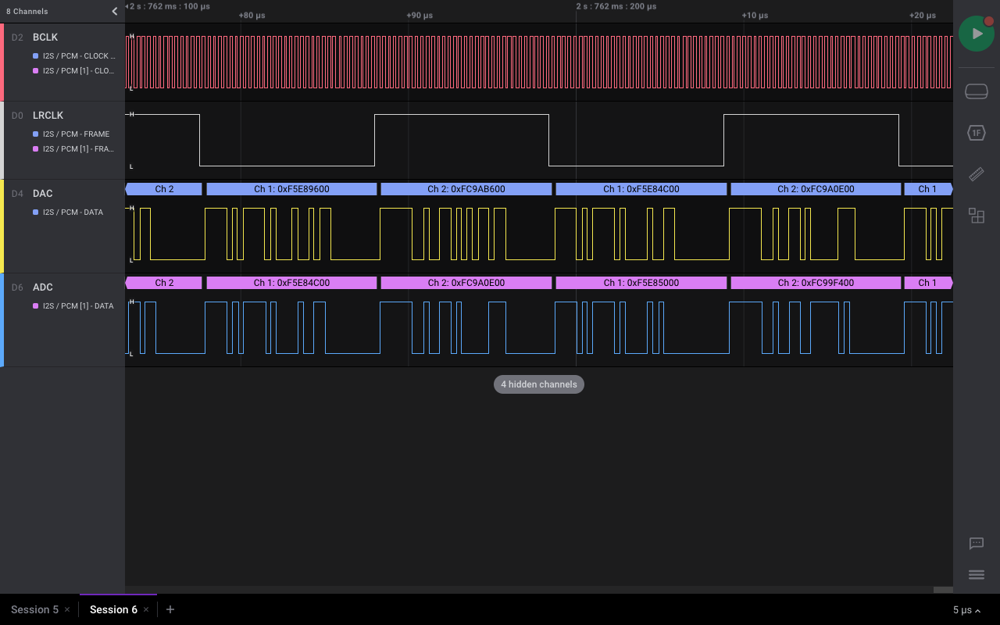
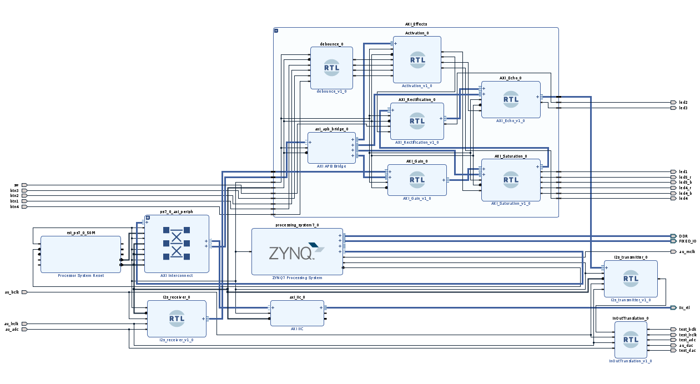

# FPGA Audio Project - ECAM Brussels 2021

## How to install 
Just open Vivado, go to Tools -> Run Tcl Script... and choose "audio-project.tcl". Everything is automatic.

## Changelog

Legend : :hammer: ​Under development  :heavy_check_mark: Done​

* **V4** Audio effects with AXIS pipelining :heavy_check_mark:
  * Gain (0 -> 20dB) :heavy_check_mark:
  * Saturation (double saturation) :heavy_check_mark:
  * Rectification (half-wave or full-wave) :heavy_check_mark:
  * FIR (up to 1024 taps using 4 parallel MAC) :heavy_check_mark:
  * Echo (up to 1.5 seconds) :heavy_check_mark:
  * Configuration by APB over Python Pynq library
* **V3** I2S communication 	:heavy_check_mark:
  * Home-made I2S receiver and transmitter
  * Selectable word size
  * Stereo compatible (support of LRCLK, one word of latency) 
* **V2** Simple design with I²C configuration 	:heavy_check_mark:
  * Changed MCLK clock to 10 MHz
  * Working I²C configuration
  * 0 dB gain between input and output
* **V1** Simple design without I²C configuration	 :heavy_check_mark: 
  * Creation of a design block
  * Connections to the different pins of the codec
  * I²S transmitter in slave mode and I²S receiver in master mode.

## Informations

This project consists of connecting the Pynq Z2 card to an audio source via the "Line IN" port and bringing out a processed sound via the "HP+MIC" combo port. 

The project revolves around the ADAU1761 codec, present on the development board. The audio is transported by the I²S protocol and the configuration of the codec with the I²C protocol. 

### I2S Protocol

* MCLK -> Master clock - 49.152 MHz
* BCLK -> Bit clock - 3 MHz
* LRCLK -> Channel clock (L or R) - 48 kHz
* ADC_DATA -> Data from ADC
* DAC_DATA -> Data to DAC

### Block design

